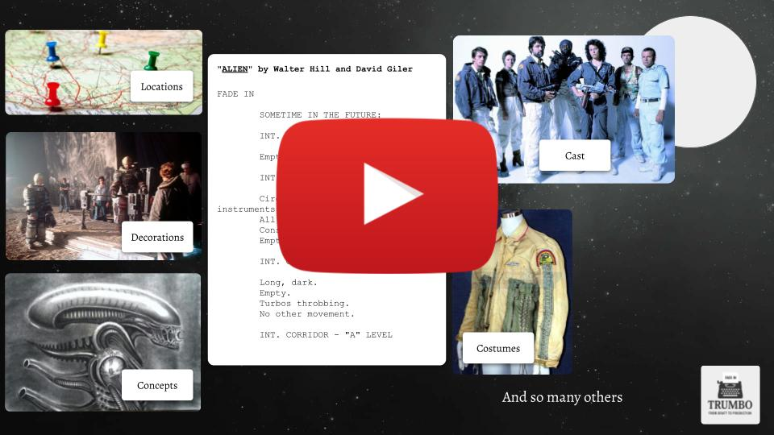
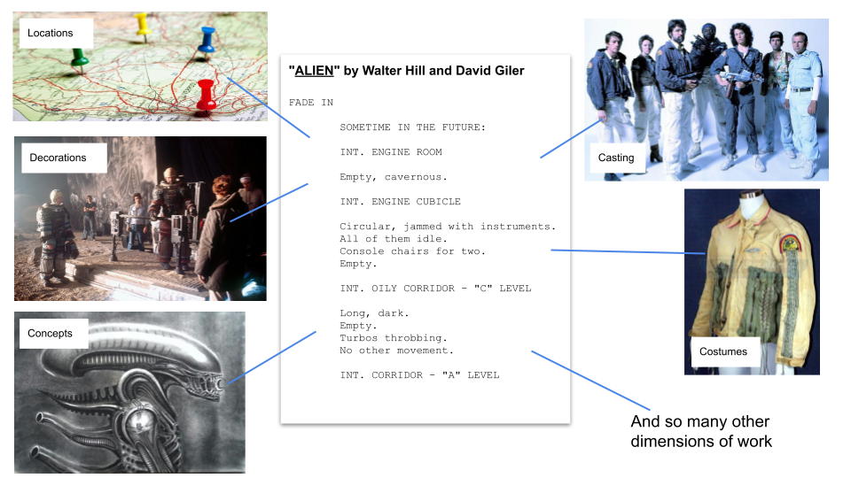
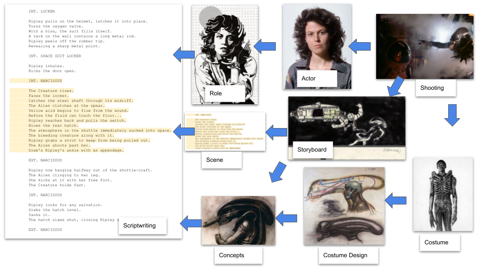
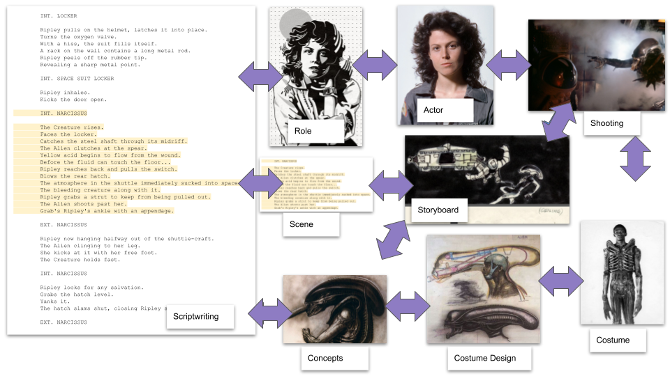

# trumbo

_A Sreenwriter's Tool_

Currently, participating [london hack @ eurasian hub](https://lu.ma/hag25rag?tk=Rrg3AR).\
This project started on the [LPB25](https://www.kxsb.org/lpb25) hackathon.

> The priority of this project is to avoid script content generation at all costs.

## The Goal

To give screenwriters and film directors a productivity tool
that optimizes routine operations and reduces communication overhead —
similar to what modern [IDE](https://www.jetbrains.com/idea/) and [GitHub](https://github.com/) tools do for software
development.

## Demo

## Key Ideas

A movie script is a well-structured text that:

1) have to comply with de-facto standards (e.g. Hollywood standard)
2) is used as a single source of truth to organise pre-production works (e.g. casting)

With a power of AI (LLM) a lot of routine operations with text can be done automatically.
Especially this requires a full script text analysis or cross-checking (e.g. give me a list of film characters).

Lots of pre-production works:

are directly based on a script, and their content and communication can be streamlined
by providing an accurate perspective (slice) of a script with an emphasis on e certain aspect.

This, of course, works in depth:

And potentially can be arranged with a support of a bidirectional feedback:

where:

1) changes made in a draft-# version of a script will automatically propagate (by email or push notification) to people
   working on derivatives (e.g. costumes)
2) if some ideas appear on later stage (
   e.g. [costume](https://en.wikipedia.org/wiki/Predator_(fictional_species)#:~:text=The%20Predator%20was%20originally%20designed,weeks%2C%20ending%20in%20February%201987.))
   it shall be possible to navigate back to the script and consistently incorporate it

## Target Audience and Profitability Considerations

This tool aims as a primary collaboration platform for all cust and crew members,
not limited to a persona of a screenwriter. That is a lot of people, with a paid subscription per seat.

Subscription might be free for screenwriters themselves, to attract them into the product.

In addition, the tool can also be used in game development, which is an additional market.

## Scope of Work & Guidance

This section covers approximate plan for the duration of the hackathon (20 days, till Apr, 25).

Sure, there is no strict bounds and order of work can be mixed as you like.

Also, many steps are optional and can be omitted (if we don't have time/competence to perform them properly).

## Contribution Guide

To contribute, **please submit PR**.

The project is in the research phase. 

It is advised to create a separate folder for your code to avoid merge conflicts. 

## Contributors

  - LPB25 - [Yerson](https://www.linkedin.com/in/yerson-lasso-0753aa1a6/)
  - LPB25 - [Peter](https://www.linkedin.com/in/peterbodnar/)

## Resources to Check

- [Trumbo film](https://en.wikipedia.org/wiki/Trumbo_(2015_film)) - watch the movie if you are curious about the project
  name
- [The Tools of Screenwriting book](https://www.amazon.co.uk/gp/product/0312119089) - **essential read** to grasp an
  idea of a screen/script writing. About 100 pages.
- [sudowrite app](https://sudowrite.com/) - a competing product for book writers. Please check optionally.

